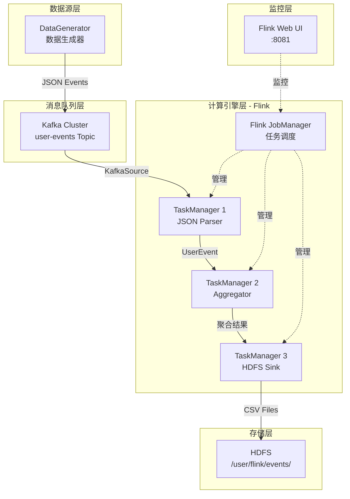

# Flink + Kafka + HDFS 大数据实时处理

## 快速开始

### 1. 启动环境
```bash
./scripts/start-env.sh
 ```
### 2. 测试连接
```bash
./scripts/test-env.sh
 ```
### 3. 运行完整程序
```bash
./scripts/run-all.sh
 ```
### 4.单独运行组件
```bash
# 只运行数据生成器
./scripts/run-generator.sh

# 只运行Flink任务
./scripts/run-flink-job.sh
 ```
### 5. 停止环境
```bash
./scripts/stop-env.sh
 ```

## 查看结果

### kafka消息
```bash
docker exec kafka kafka-console-consumer --bootstrap-server localhost:9092 --topic user-events --from-beginning
 ```
### hdfs文件
```bash
docker exec namenode hdfs dfs -ls /user/flink/events/
docker exec namenode hdfs dfs -cat /user/flink/events/part-* | head -10
 ```
### Flink WebUI
```bash
http://localhost:8081
 ```

# 设计思路
## 架构设计


## 流程分析

 ```
DataGenerator → Kafka(user-events) → Flink Source → JSON解析 → KeyBy(userId)→ 实时聚合(AmountAggregator) → HDFS Sink(CSV格式)
 ```
