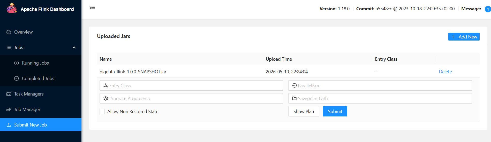
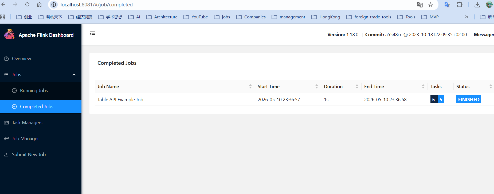

# bigdata-flink 模块 Web UI 测试指南



## 前提条件

```bash
# 1. 构建 Fat JAR
cd D:\code\bigdata
mvn clean package -pl bigdata-flink -DskipTests

# 2. 启动集群
cd bigdata-flink
docker compose up -d

# 3. 验证服务
docker compose ps
# jobmanager、taskmanager、kafka、mysql 均为 Up

# 4. 打开 Flink Web UI
# http://localhost:8081
```

---

## 一、通过 Web UI 提交作业

### 步骤

1. 打开 http://localhost:8081
2. 左侧菜单 → **"Submit New Job"**
3. 点击 **"+ Add New"** 按钮
4. 选择文件 `D:\code\bigdata\bigdata-flink\target\bigdata-flink-1.0.0-SNAPSHOT.jar`
5. 上传完成后，点击 JAR 名称进入配置页
6. 填写 **Entry Class**（入口类全限定名）
7. 设置 **Parallelism**（建议 4）
8. 点击 **Submit** 提交

---

## 二、无需外部依赖的示例（立即可测）

### 测试 1：DataSkewHandling（推荐首选）

| 配置项 | 值 |
|--------|-----|
| Entry Class | `com.boonya.lab.flink.example.production.DataSkewHandling` |
| Parallelism | `4` |

**预期结果**：
- 作业短暂运行后自动完成（FINISHED 状态）
- 左侧 **"Job Manager" → "Stdout"** 查看输出：

```
CustomPartitioner:1> (normal_1,1)
CustomPartitioner:2> (popular_item,4)
CustomPartitioner:2> (normal_2,1)
CustomPartitioner:3> (normal_3,2)
TwoPhase:2> (normal_1,1)
TwoPhase:2> (popular_item,4)
TwoPhase:2> (normal_2,1)
TwoPhase:2> (normal_3,2)
Rebalance:2> (normal_1,1)
Rebalance:2> (normal_3,2)
Rebalance:2> (popular_item,4)
Rebalance:2> (normal_2,1)
```

**验证点**：三种倾斜处理方案都输出了正确的聚合结果。

### 测试 2：FlinkTableAPIExample

| 配置项 | 值 |
|--------|-----|
| Entry Class | `com.boonya.lab.flink.example.sql.FlinkTableAPIExample` |
| Parallelism | `4` |

**预期输出**（Job Manager → Stdout）：

```
(true, +I[Bob, 250, 125.0, 2])
(true, +I[Alice, 330, 110.0, 3])
(true, +I[Charlie, 300, 300.0, 1])
```

**验证点**：Alice 总额 330(>200)、Bob 250(>200)、Charlie 300(>200) 全部通过 filter，聚合值正确。

### 测试 3：FlinkApplication

| 配置项 | 值 |
|--------|-----|
| Entry Class | `com.boonya.lab.flink.FlinkApplication` |
| Parallelism | `4` |

**预期结果**：作业提交后处于 **RUNNING** 状态，Overview 页面显示 1 个 Running Job。这是生产级配置的空作业模板，持续运行直到手动取消。

### 测试 4：TroubleshootingGuide（验证 JAR 包完整性）

| 配置项 | 值 |
|--------|-----|
| Entry Class | `com.boonya.lab.flink.example.production.TroubleshootingGuide` |
| Parallelism | `1` |

**预期输出**（Job Manager → Stdout）：

```
=== Checkpoint Timeout ===
1. 增大 checkpointTimeout...
=== Backpressure ===
1. 增大瓶颈算子的并行度...
=== OutOfMemoryError ===
1. 增加 taskmanager.memory.process.size...
=== Kafka Consumer Lag ===
1. 增大 Kafka Source 并行度...
```

---

## 三、需要外部依赖的示例

### 测试 5：UserBehaviorAnalysis（需要 Kafka）

```bash
# 准备：创建 Topic
docker compose exec kafka kafka-topics --create \
  --topic user-behavior-log \
  --bootstrap-server kafka:29092 \
  --partitions 4 --replication-factor 1

# 准备：发送测试数据
docker compose exec kafka bash -c "
echo 'user1,click,item1,1000' | kafka-console-producer --topic user-behavior-log --bootstrap-server kafka:29092
echo 'user1,view,item2,2000'  | kafka-console-producer --topic user-behavior-log --bootstrap-server kafka:29092
echo 'user1,purchase,item3,3000' | kafka-console-producer --topic user-behavior-log --bootstrap-server kafka:29092
echo 'user2,click,item4,4000' | kafka-console-producer --topic user-behavior-log --bootstrap-server kafka:29092
echo 'user2,purchase,item5,5000' | kafka-console-producer --topic user-behavior-log --bootstrap-server kafka:29092
"
```

| 配置项 | 值 |
|--------|-----|
| Entry Class | `com.boonya.lab.flink.example.datastream.UserBehaviorAnalysis` |
| Parallelism | `4` |

**预期输出**（Job Manager → Stdout）：

```
UserStatistics{userId='user1', click=1, view=1, purchase=1, lastAccess=3000}
UserStatistics{userId='user2', click=1, view=0, purchase=1, lastAccess=5000}
```

### 测试 6：StateManagementExample（需要 nc/socket）

```bash
# 发送测试数据到 socket
# Linux/Mac:
echo "user1,click,electronics,100.5,$(date +%s)" | nc localhost 9999

# Windows PowerShell:
# 需先安装 netcat，或用 Docker 容器发数据
```

| 配置项 | 值 |
|--------|-----|
| Entry Class | `com.boonya.lab.flink.example.state.StateManagementExample` |
| Parallelism | `4` |

**预期输出**（Job Manager → Stdout）：

```
UserProfile{userId='user1', total=100.50, recent=1, favorite='electronics'}
```

### 测试 7：FlinkSQLExample（需要 Kafka + MySQL）

```bash
# 准备 MySQL 表
docker compose exec mysql mysql -uroot -proot flink_db -e "
CREATE TABLE IF NOT EXISTS user_behavior_count (
  user_id VARCHAR(64),
  behavior VARCHAR(32),
  cnt BIGINT,
  window_start TIMESTAMP(3),
  window_end TIMESTAMP(3),
  PRIMARY KEY (user_id, behavior, window_start)
);
"

# 准备 Kafka topic
docker compose exec kafka kafka-topics --create \
  --topic user_behavior \
  --bootstrap-server kafka:29092 \
  --partitions 4 --replication-factor 1

# 发送 JSON 测试数据
docker compose exec kafka bash -c "
echo '{\"user_id\":\"user1\",\"item_id\":\"item1\",\"category_id\":\"c1\",\"behavior\":\"click\",\"ts\":1700000000}' | \
kafka-console-producer --topic user_behavior --bootstrap-server kafka:29092
"
```

| 配置项 | 值 |
|--------|-----|
| Entry Class | `com.boonya.lab.flink.example.sql.FlinkSQLExample` |
| Parallelism | `4` |

**验证**：提交后观察日志无报错，查询 MySQL 确认有结果写入：

```bash
docker compose exec mysql mysql -uroot -proot flink_db -e "SELECT * FROM user_behavior_count;"
```

### 测试 8：WindowExample（需要 nc/socket）

```bash
# 发送交易数据 (transactionId,userId,merchantId,amount,status,timestamp)
nc -lk 9999 <<EOF
tx1,user1,merchantA,100.0,SUCCESS,1700000000000
tx2,user1,merchantA,200.5,FAILED,1700000000100
tx3,user2,merchantB,50.0,SUCCESS,1700000000200
EOF
```

| 配置项 | 值 |
|--------|-----|
| Entry Class | `com.boonya.lab.flink.example.window.WindowExample` |
| Parallelism | `4` |

**预期输出**：Tumbling、Sliding、Session 三种窗口各有对应的 TransactionStatistics / UserSession 输出。

---

## 四、通过 CLI 提交作业

```bash
# 通用格式
docker compose exec jobmanager flink run -d \
  -c <EntryClass> \
  /opt/flink/usrlib/bigdata-flink-1.0.0-SNAPSHOT.jar

# 示例
docker compose exec jobmanager flink run -d \
  -c com.boonya.lab.flink.example.production.DataSkewHandling \
  /opt/flink/usrlib/bigdata-flink-1.0.0-SNAPSHOT.jar

# 查看运行中的作业
docker compose exec jobmanager flink list

# 取消作业
docker compose exec jobmanager flink cancel <job-id>
```

---

## 五、作业监控

| Web UI 页面 | 说明 |
|------------|------|
| **Overview** | Slot 使用率、运行中/已完成作业数 |
| **Running Jobs** | 点击作业名 → 查看 JobGraph（算子 DAG、并行度、背压状态） |
| **Job Manager → Stdout** | 查看 `print()` / `System.out` 输出 |
| **Job Manager → Configuration** | 当前作业的运行时配置 |
| **Task Managers** | 点击 TM → Metrics（CPU、内存、GC、Network） |
| **Job Manager → Log** | JobManager 运行日志 |

---

## 六、常见问题

| 问题 | 解决方案 |
|------|---------|
| JAR 上传后看不到 | 检查 `docker-compose.yml` 中 `./target:/opt/flink/usrlib` 挂载 |
| 作业提交后无输出 | 检查 Entry Class 是否正确；查看 Job Manager → Log 排查异常 |
| Kafka 连接超时 | 确认 bootstrap-server 使用容器内地址 `kafka:29092` 而非 `localhost:9092` |
| 作业状态 CANCELLED | 检查 Task Manager → Log 是否有异常堆栈 |
| ClassNotFoundException | 确认依赖 scope 正确（provided 的依赖不在 JAR 中，需集群提供） |

---

## 推荐测试顺序

1. **DataSkewHandling** — 验证提交链路正常
2. **FlinkTableAPIExample** — 验证 Table API 功能
3. **FlinkApplication** — 验证长运行作业
4. **UserBehaviorAnalysis** — 验证 Kafka 集成
5. **FlinkSQLExample** — 验证 SQL + JDBC 集成

## 特别注意



- job-submitter 是一次性容器——提交作业后立即退出，docker compose ps 显示 Exited 容易误认为失败。而且每次 docker compose up -d 都会重新提交同一作业，造成重复。
- docker compose up -d 只启动 Flink + Kafka + MySQL 持久服务，不再触发作业提交。
```
# 方式1：docker compose 一次性运行
docker compose run --rm job-submitter

# 方式2：通过 Flink CLI（可用任意入口类）
docker compose exec jobmanager flink run -d \
-c com.boonya.lab.flink.example.sql.FlinkTableAPIExample \
/opt/flink/usrlib/bigdata-flink-1.0.0-SNAPSHOT.jar

# 方式2：通过 Flink CLI（可用任意入口类）--windows不换行
docker compose exec jobmanager flink run -d -c com.boonya.lab.flink.example.sql.FlinkTableAPIExample /opt/flink/usrlib/bigdata-flink-1.0.0-SNAPSHOT.jar
```